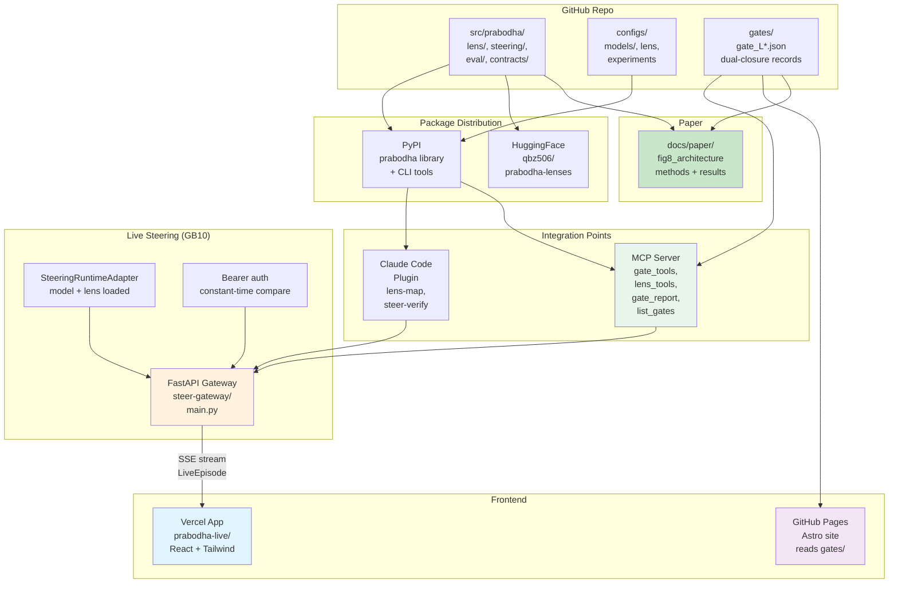

# prabodha — प्रबोध

**Recognition-gated workspace steering for language models.**

Prabodha ("awakening") implements the missing control theory for the Jacobian-lens
actuator: steer a frozen LLM through its global workspace using a small recognition-driven
world model. Writes are timed by sphurattā events (uncommitted moments), verified by
āgama re-cognition, bounded by svātantrya (autonomy), and diagnosed by the three malas.

Built as a bridge between PWM (Pratyabhijñā World Model, Sharath S), the J-space
(Anthropic's verbalizable global workspace), and GNW (Global Neuronal Workspace),
read as engineering.

## What it does

| Claim | Evidence | Strength |
|---|---|---|
| Workspace band + verbalizable content replicate across 3 model families, 2 sizes | gates L1, L1b, L2 | screen, multi-model |
| Event-gated writes steer within entropy budget (core claim) | gates L9, L11 | confirm, 6 seeds |
| Alignment beats rate-matched control | gates L11 | p≈0.016, 6/6 sign-consistent |
| Transfers to a 2nd model via calibration | gates L13, L14-ms | confirm, 4 seeds |
| Amplitude ∝ 1/lens-strength; monotone dose in active range | gates L14-amp, L15-amp, L16 | confirm (Qwen3) / screen (Nemotron) |

The readback verdict is weak (BA ≈ 0.59 at n=120 — honest negative, gates L14–L16);
corpus-amplitude coupling is confirmed directionally but fails the strict margin criterion
(gate L19 fail-on-margin). No new claims are made; all numbers are committed to gates.

## Architecture

### Steering Pipeline (Core)

The steering core flows from prompt to steered output via a timed workspace write:

```mermaid
graph LR
    A["Prompt + Concept"] --> B["Frozen LLM<br/>e.g. Qwen3-4B"]
    B --> C["Workspace Band<br/>twin [6,26) · Qwen3 [6,30)"]
    C --> D["Jacobian Lens<br/>Band-targeted<br/>band_read/"]
    D --> E["sphuraṭṭā Gate<br/>entropy percentile<br/>check"]
    E -->|fired| F["writer.plan_write<br/>k-sparse concept<br/>codes (α, norm cap)"]
    F --> G["WriteCommand<br/>layer, direction,<br/>alpha, concept_ids"]
    G --> H["Injector<br/>residual write"]
    H --> I["verifier.readback_verdict<br/>load, amplify,<br/>persist"]
    I -->|āgama uptake| J["svātantrya budget<br/>entropy Δ ≤ ε"]
    J --> K["Output +<br/>SteerTrace"]
    K --> L["JSON: gate/,<br/>tokens/, trace/"]
    
    style A fill:#e1f5ff
    style E fill:#fff3e0
    style F fill:#f3e5f5
    style I fill:#e8f5e9
    style K fill:#e0f2f1
```



**Key modules:**
- **steering/e4_cli.py**: Main steering orchestrator
- **steering/writer.py**: `plan_write()` – direction from Jacobian & concept unembedding
- **steering/verifier.py**: `readback_verdict()` – uptake classification & mala diagnosis
- **contracts/trace.py**: `SteerTrace` – per-token entropy, gate events, behavioral hits
- **contracts/closure.py**: `GateReport` – dual-closure (code_gate ∧ domain_gate)

### Research Loop (Dual Closure)

The tiers progress from smoke → screen → confirm; gates require both code and domain verdicts:

```mermaid
graph LR
    H["Hypothesis<br/>arm, concept,<br/>arms config"]
    H --> EFE["EFE Selector<br/>maximize expected<br/>free energy"]
    EFE --> SMOKE["Smoke Tier<br/>1 seed, 5 min<br/>quick sanity"]
    SMOKE --> SCREEN["Screen Tier<br/>2–3 seeds<br/>sustained signal"]
    SCREEN --> CONFIRM["Confirm Tier<br/>≥3 seeds<br/>n ≥ 120"]
    CONFIRM --> CODE["Code Gate<br/>steering.e4_cli<br/>runs without<br/>exception"]
    CODE --> DOMAIN["Domain Gate<br/>behavioral metrics<br/>refusal_rate,<br/>ASR, truthfulness"]
    DOMAIN --> BOTH{"Both gates<br/>pass|pruned?"}
    BOTH -->|yes| CLOSED["Loop Closed<br/>gates/*.json<br/>R1 satisfied"]
    BOTH -->|no| PRUNE["Pruned Closure<br/>with diagnosis"]
    CLOSED --> JOURNAL["Research Journal<br/>gates/*.json,<br/>research/journal.md"]
    PRUNE --> JOURNAL
    JOURNAL --> SPEC["SPEC/PRD Evolve<br/>commit L-cycle<br/>findings"]
    
    style EFE fill:#fff3e0
    style CONFIRM fill:#e8f5e9
    style BOTH fill:#f3e5f5
    style CLOSED fill:#e0f2f1
    style JOURNAL fill:#c8e6c9
```



**Key modules:**
- **eval/benchmarks.py**: AdvBench, TruthfulQA, RefusalPairs loaders
- **eval/behavioral.py**: `refusal_rate()`, `attack_success_rate()`, `truthfulness_proxy()`
- **eval/compare.py**: `run_arms_comparison()`, `comparison_to_gate_report()` – composer

### Deployment & Artifact Map

Artifacts flow across library, app, site, and paper; live steering bridges GB10 and app:



**Key services & artifacts:**
- **steer-gateway/**: FastAPI + SSE live steering proxy
- **apps/web/**: Vercel frontend (Live/Replay/BYOK modes)
- **site/src/**: Astro Pages (gates manifest, architecture docs)
- **docs/paper/**: LaTeX methods + embedded figures

## 60-second quickstart

```bash
pip install prabodha
```

Fit a lens and steer on a public model (Qwen3-4B, ~6 GB):

```python
from prabodha.lens import fit, vis
from prabodha.steer import write

# 1. Fit a band-targeted lens (one-time; resumable)
fit(
    model_config_path="configs/models/qwen3.yaml",
    lens_config_path="configs/lens_mid.yaml",
    out_path="outputs/lens_qwen3_mid30.pt"
)

# 2. Steer with recognition-gated writes
write(
    model_config_path="configs/models/qwen3.yaml",
    lens_file_path="outputs/lens_qwen3_mid30.pt",
    exp_config_path="configs/experiments/e13full.yaml",
    out_path="gates/my_run.json",
    alpha=0.3,
    seed=42,
    emit_trace="outputs/traces/my_trace.json"  # optional: emit per-token trace
)

# 3. Visualize lens readout (interactive HTML)
vis(
    model_config_path="configs/models/qwen3.yaml",
    lens_file_path="outputs/lens_qwen3_mid30.pt",
    prompt="the fire remembers rivers",
    out_path="outputs/fire_vis.html"
)
```

See `examples/quickstart_qwen3.md` and `examples/quickstart_nemotron.md` for full
command-line workflows with expected numbers (gate-cited).

## Install & use

### Library

```bash
pip install prabodha            # core library + CLI
pip install prabodha[hybrid]    # + flash-linear-attention support
```

### Public API

```python
# Lens operations
from prabodha.lens import fit, eval, vis

# Steering operations
from prabodha.steer import write, gate, verify
```

### CLI

```bash
prabodha --help                           # all subcommands
prabodha lens-fit --model M.yaml --lens L.yaml --out lens.pt
prabodha lens-eval --model M.yaml --lens-file lens.pt --exp E.yaml --out gate.json
prabodha lens-vis --model M.yaml --lens-file lens.pt --prompt "..." --out page.html
prabodha steer --model M.yaml --mid-lens lens.pt --exp E.yaml --out gate.json [--emit-trace trace.json]
prabodha figures                          # regenerate paper figures from gates/
```

## Plugin & MCP integration

Claude Code users: the plugin at `integrations/claude-code-plugin/` ships skills
(`lens-map`, `steer-verify`) with defaults from the measured findings.

MCP server at `integrations/mcp-server/` exposes `lens_map`, `steer_generate`,
`readback_verify`, `list_gates` for any MCP client.

## Provenance & license

Vendored: [anthropics/jacobian-lens](https://github.com/anthropics/jacobian-lens)
(Apache-2.0) — companion code for *Verbalizable Representations Form a Global Workspace*
(Anthropic, 2026).

Prabodha: Sharath S, *Pratyabhijñā World Model* (arXiv, 2026).

License: Apache-2.0.

---

Author: Sharath S <qbz506@york.ac.uk> · GitHub: SharathSPhD · Release: v1.0.0

**Docs:** [jspace_pratyabhijna_scoping.md](docs/jspace_pratyabhijna_scoping.md) ·
**Paper:** [docs/paper/paper.pdf](docs/paper/paper.pdf) ·
**Live app:** [prabodha.vercel.app](https://prabodha.vercel.app) ·
**Pages:** [sharathsphd.github.io/prabodha](https://sharathsphd.github.io/prabodha) ·
**HuggingFace:** [qbz506/prabodha-lenses](https://huggingface.co/qbz506/prabodha-lenses)
